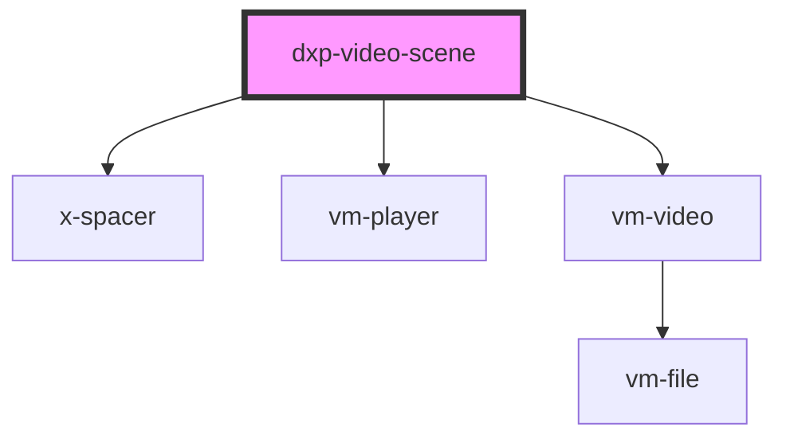

# dxp-video-scene

<!-- Auto Generated Below -->

## Properties

| Property      | Attribute      | Description | Type     | Default     |
| ------------- | -------------- | ----------- | -------- | ----------- |
| `buttonLabel` | `button-label` |             | `string` | `undefined` |
| `ccUrl`       | `cc-url`       |             | `string` | `undefined` |
| `mainTitle`   | `main-title`   |             | `string` | `undefined` |
| `posterUrl`   | `poster-url`   |             | `string` | `undefined` |
| `subtitle`    | `subtitle`     |             | `string` | `undefined` |
| `videoUrl`    | `video-url`    |             | `string` | `undefined` |

## Dependencies

### Depends on

- [x-spacer](../../../components/x-spacer)
- vm-player
- vm-video

### Graph

----------------------------------------------

*Built with [StencilJS](https://stenciljs.com/)*
