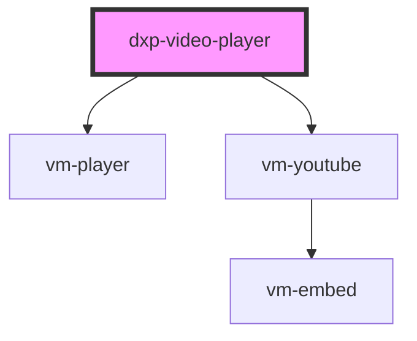

# dxp-video-scene

<!-- Auto Generated Below -->

## Properties

| Property    | Attribute    | Description | Type     | Default     |
| ----------- | ------------ | ----------- | -------- | ----------- |
| `youtubeId` | `youtube-id` |             | `string` | `undefined` |

## Dependencies

### Depends on

- vm-player
- vm-youtube

### Graph

----------------------------------------------

*Built with [StencilJS](https://stenciljs.com/)*
